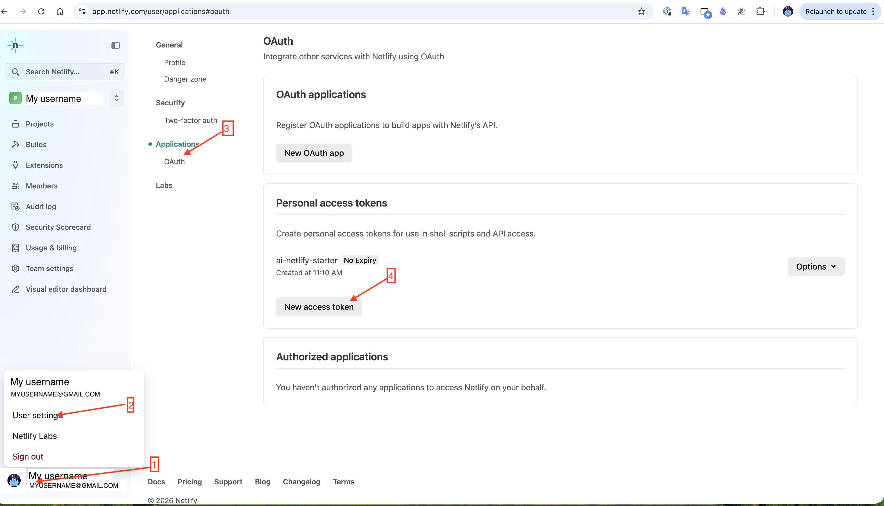
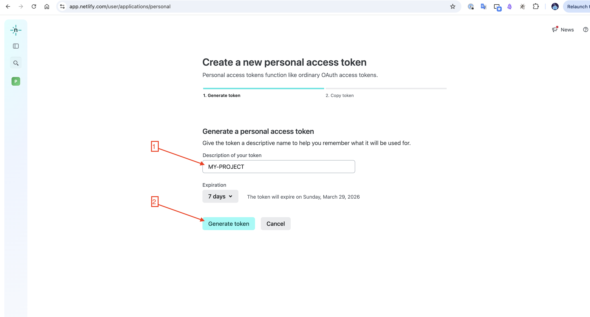
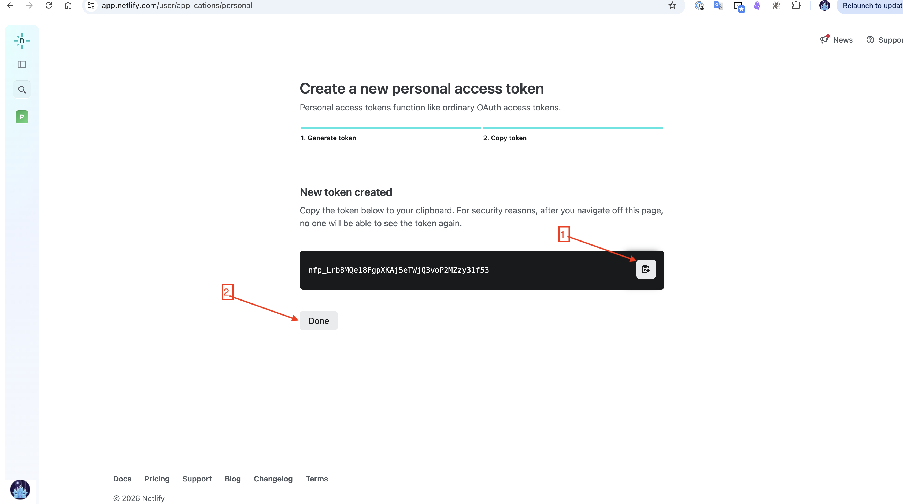
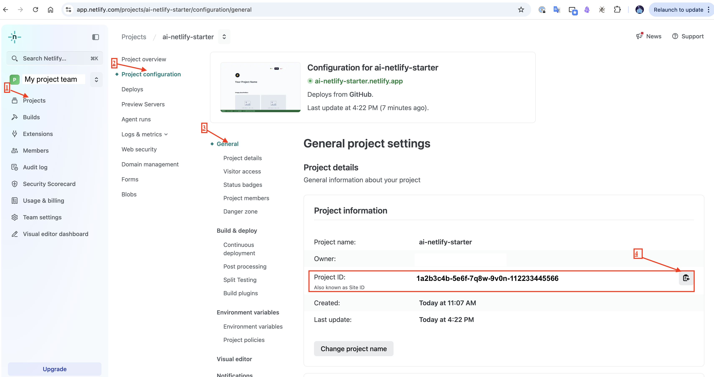
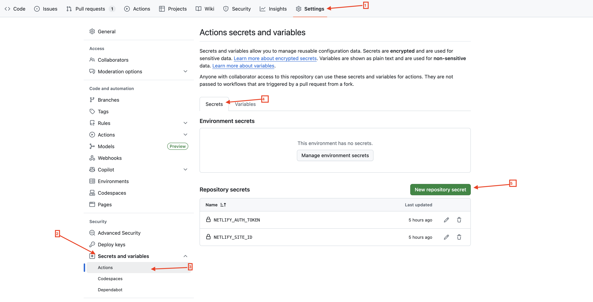
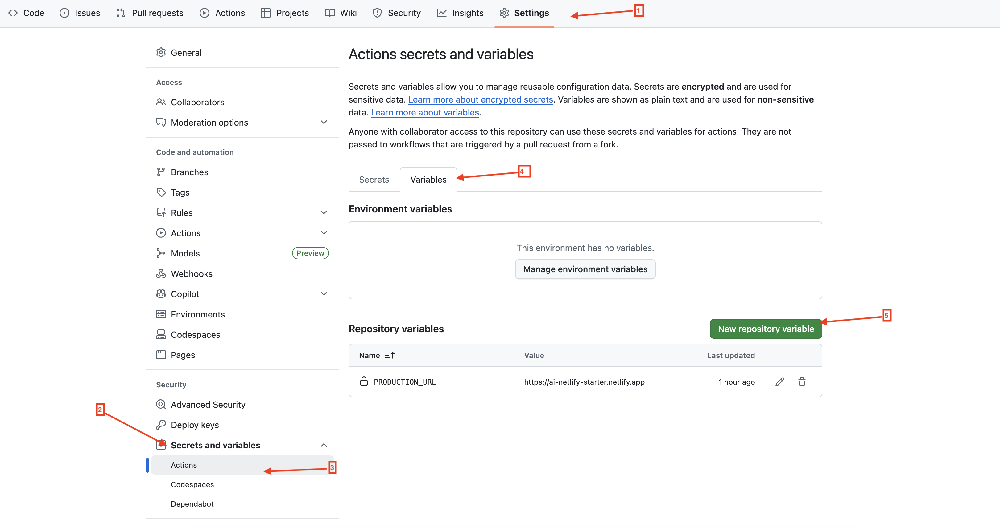

# AI Netlify Starter

A ready-made website template. Fork it, connect it to two free services, and your site is live — with automatic updates every time you save changes.

[](https://ai-netlify-starter.netlify.app)

**Live demo:** https://ai-netlify-starter.netlify.app

---

## What you get

- **Your site is live in minutes** — no servers to manage, no hosting bills (free tier)
- **Changes go live automatically** — push a change and it deploys itself
- **Safe previews before publishing** — every draft gets its own preview link so you can check it before it goes live
- **Contact form included** — visitors can message you, submissions land in your Netlify dashboard
- **Ukrainian / English / Polish** — language switcher built in, easy to add more
- **Placeholder images** — broken images show a clean fallback instead of a broken icon

---

## How it works (no tech required)

1. You write your content and push it to GitHub (like saving to the cloud)
2. GitHub automatically builds your site and sends it to Netlify
3. Netlify puts it online — instantly

---

## Pull request previews

Every time you open or update a pull request, the CI pipeline automatically:

1. Builds the site and deploys it to a unique preview URL (e.g. `https://abc123--your-site.netlify.app`)
2. Posts a comment on the PR with:
   - A direct link to that specific preview build
   - A link to the production site for comparison
   - Branch name, commit hash, and build timestamp
3. Updates the **same comment** on every new push — no spam, one comment per PR
4. Deletes the preview deployment from the GitHub Environments list when the PR is merged or closed

Example PR comment:

```
🚀 Preview ready

| | |
|---|---|
| 🔍 Preview   | https://abc123--your-site.netlify.app |
| 🌍 Production | https://your-site.netlify.app         |
| 🌿 Branch    | my-feature                            |
| 📝 Commit    | a1b2c3d                               |
| 🕐 Built at  | 2026-03-22T14:00:00Z                  |

> Preview updates automatically on every push to this PR.
```

---

## One-time setup (~15 minutes)

You need two free accounts: **GitHub** (stores your code) and **Netlify** (hosts your site).

### Step 1 — Copy this template

1. Click **Use this template → Create a new repository** at the top of this page
2. Give your repository a name (e.g. `my-website`)
3. Click **Create repository**

### Step 2 — Connect Netlify

1. Go to [app.netlify.com](https://app.netlify.com) and sign up (free)
2. Click **Add new site → Import from Git**
3. Choose GitHub and select your new repository
4. Click **Deploy** — Netlify reads the settings automatically

### Step 3 — Link GitHub to Netlify

This is the one technical step. It lets GitHub trigger deploys automatically.

**Get your Netlify auth token:**

1. Click your avatar (bottom-left) → **User settings**
2. Go to **Applications → Personal access tokens → New access token**



3. Give it a name and set an expiration, then click **Generate token**



4. Copy the token — it is only shown once



**Get your Netlify Project ID:**

Go to your site → **Project configuration → General** — the Project ID is shown under **Project information**.



**Add secrets to GitHub:**

In your GitHub repository go to **Settings → Secrets and variables → Actions → Secrets tab → New repository secret** and add `NETLIFY_AUTH_TOKEN` and `NETLIFY_SITE_ID`.



**Add the production URL variable:**

Switch to the **Variables** tab → **New repository variable** and add `PRODUCTION_URL` with your Netlify site URL (e.g. `https://my-website.netlify.app`).



That's it. Push any change and your site updates automatically.

---

## Making it your own

- **Replace the placeholder images** in `public/images/` with your own photos
- **Edit the text** in `src/locales/en.js` (and `uk.js` / `pl.js` for other languages)
- **Change colors and fonts** in `src/styles/global.css` (CSS custom properties at the top of the file)
- **Add your components** in `src/components/` — each section of the page is its own folder

---

## Working locally (optional)

If you want to preview changes on your own computer before pushing:

```bash
cp .env.example .env
npm install
npm run dev        # opens http://localhost:5173
```

---

## Need help?

- **Preview not updating?** — check the Actions tab in GitHub for errors
- **Form not working?** — the contact form only accepts submissions on the live production site, not previews
- **Something broken?** — open an issue in this repository
